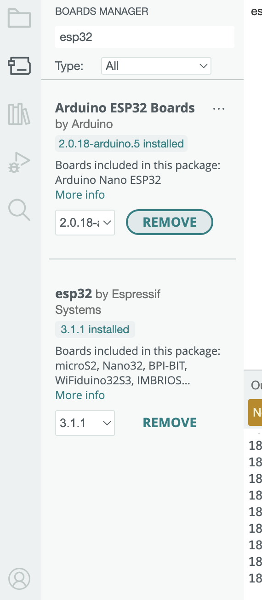

# Blink ESP-32

## Install Requirements

- [Install Arduino IDE](https://www.arduino.cc/en/software)
- Install ESP-32 Boards
  - 
- [Install Nodejs](https://nodejs.org/en)
- Install local tunnel

```bash
npm install -g localtunnel
```

## Uploading to ESP-32

In Tools > Board Settings, set:

Setting Value
Upload Speed 115200
CPU Frequency 240 MHz (WiFi/BT)
Flash Frequency 80MHz
Flash Mode QIO
Flash Size 4MB (32Mb)
Partition Scheme Default 4MB with spiffs
PSRAM Disabled (unless your board has it)

## Blink the Internal LED.

```cpp
#define LED_PIN 2  // Built-in LED or external LED on GPIO2

void setup() {
    pinMode(LED_PIN, OUTPUT); // Set GPIO2 as an output
}

void loop() {
    digitalWrite(LED_PIN, HIGH); // Turn LED on
    delay(1000);                 // Wait 1 second
    digitalWrite(LED_PIN, LOW);  // Turn LED off
    delay(1000);                 // Wait 1 second
}
```

## Create a nodejs server

1. Type in the terminal npm init -y
2. Create your app.js file.

```js
const express = require("express");
const app = express();
const port = 3000;
var state = "OFF";
// Define a GET endpoint
app.get("/", (req, res) => {
  console.log(state, "Sent State");
  res.send(state);
});

app.get("/change/:on", (req, res) => {
  state = req.params.on == "ON" ? "ON" : "OFF";
  res.send(state);
});
// Start the server
app.listen(port, () => {
  console.log(`Server is running on http://localhost:${port}`);
});
```

3. run node app.js in the terminal
4. Run lt --port 3000 in the terminal
5. Go to your url and enter the password to access it.
6. Go to the Arduino IDE and create a new file.

```cpp
#include <WiFi.h>
#include <HTTPClient.h>

#define LED_PIN 23  // Change if using a different GPIO

// Replace with your WiFi credentials
const char* WIFI_SSID = "Noisebridge";
const char* WIFI_PASSWORD = "noisebridge";

// Replace with your API endpoint
const char* SERVER_URL = "http://replace_url.com/";

void setup() {
    Serial.begin(115200);
    pinMode(LED_PIN, OUTPUT);
    WiFi.begin(WIFI_SSID, WIFI_PASSWORD);

    Serial.print("Connecting to WiFi...");
    while (WiFi.status() != WL_CONNECTED) {
        delay(1000);
        Serial.print(".");
    }
    Serial.println("\nConnected to WiFi!");
}

void loop() {
    if (WiFi.status() == WL_CONNECTED) {
        HTTPClient http;
        http.begin(SERVER_URL);

        int httpResponseCode = http.GET();
        if (httpResponseCode > 0) {
            String response = http.getString();
            response.trim(); // Remove unwanted spaces/newlines

            Serial.print("Server Response: ");
            Serial.println(response);

            if (response == "ON") {
                digitalWrite(LED_PIN, HIGH);
            } else if (response == "OFF") {
                digitalWrite(LED_PIN, LOW);
            }
        } else {
            Serial.print("Error on HTTP request: ");
            Serial.println(httpResponseCode);
        }

        http.end();
    } else {
        Serial.println("WiFi Disconnected! Reconnecting...");
        WiFi.begin(WIFI_SSID, WIFI_PASSWORD);
    }

    delay(5000);  // Check every 5 seconds
}
```

7\. Upload the code

8\. Change the state from on to off using the change/ON url.

9\. Play around with this and see if you can get the arduino to blink as a challenge.
